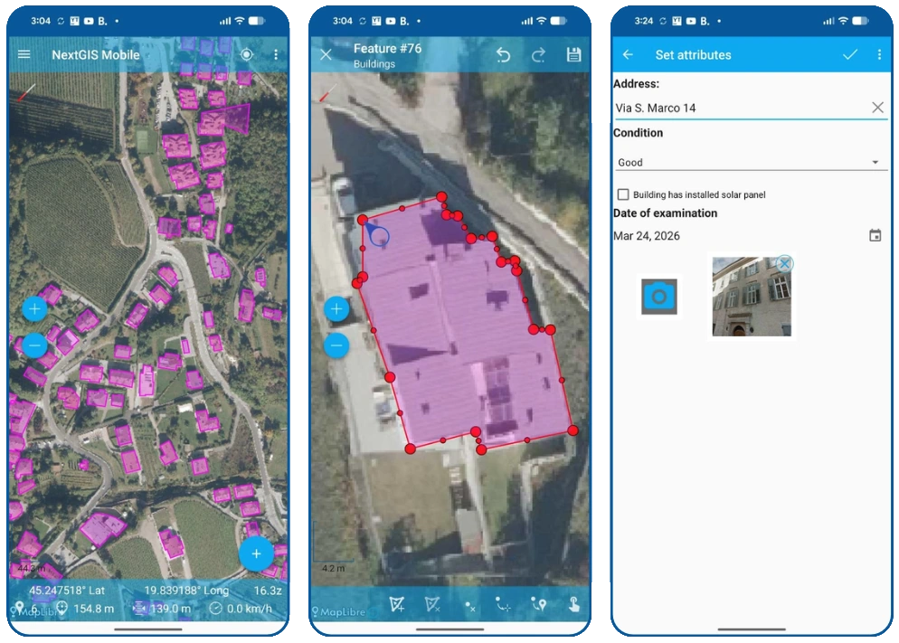
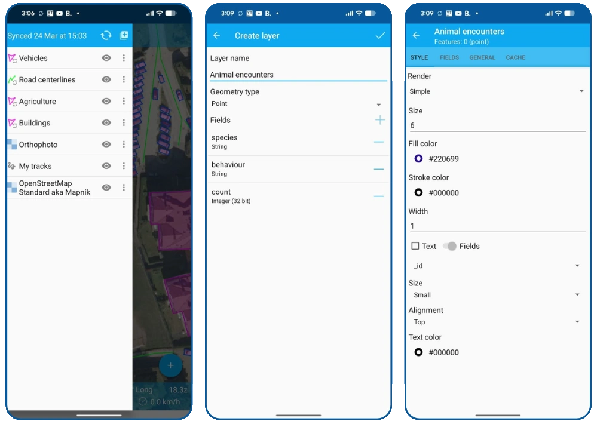

# NextGIS Mobile

**NextGIS Mobile** is an open-source mobile GIS application for Android, designed for field data collection, offline mapping, and real-time synchronization with NextGIS Web.

It extends your GIS workflows beyond desktop, enabling teams to collect, edit, and validate geospatial data directly in the field, even without internet connection.

## Table of contents

- [Key capabilities](#key-capabilities)
  - [Field data collection](#field-data-collection)
  - [Offline-first workflows](#offline-first-workflows)
  - [Synchronization with NextGIS Web](#synchronization-with-nextgis-web)
  - [Map visualization and layer control](#map-visualization-and-layer-control)
  - [GPS tracking](#gps-tracking)
  - [Data management and editing](#data-management-and-editing)
- [Typical use cases](#typical-use-cases)
- [Installation](#installation)
- [Documentation](#documentation)
- [Community and ecosystem](#community-and-ecosystem)
- [Commercial support](#commercial-support)
- [License](#license)

## Key capabilities

### Field data collection

- **Collect geospatial data in the field**  
  Create and edit points, lines, and polygons using intuitive mobile tools.

- **Flexible attribute forms**  
  Fill structured forms with domains and predefined values.

- **Photo support**  
  Capture photos and attach them to features directly from the device.

### Offline-first workflows

- **Work without internet connection**  
  Access maps and datasets offline in remote areas.

- **Local data storage**  
  Store collected data safely on the device until synchronization.

- **Offline basemaps support**  
  Use raster basemaps without connectivity.

### Synchronization with NextGIS Web

- **Seamless sync with server**  
  Upload collected data to NextGIS Web and download updates from other users.

- **Multi-user collaboration**  
  Field teams and office staff work on the same datasets.

### Map visualization and layer control

- **Interactive maps on mobile devices**  
  View multiple layers with styling and labeling.

- **Layer control and data search**  
  Enable/disable layers and explore data dynamically.

### GPS Tracking

- **GPS-based positioning and tracking**  
  Track current location and record movement history.

### Data management and editing

- **Create layers locally**  
  Create new vectors layers and then sync them with NextGIS Web if needed.

- **Edit existing datasets**  
  Update attributes and geometries directly in the field.

- **Work with NextGIS Web resources**  
  Connect to layers, maps, and services published in NextGIS Web.

## Typical use cases

- Field surveys and environmental monitoring
- Infrastructure inspection and asset management  
- Municipal data collection (utilities, roads, cadastre, etc.)  
- NGO and research field campaigns  
- Emergency response and rapid mapping

## Installation

- [Install from Google Play](https://play.google.com/store/apps/details?id=com.nextgis.mobile)
- [Get the latest release (apk) at my.nextgis.com](https://my.nextgis.com/software)

## Documentation

📘 [User documentation](https://docs.nextgis.com/docs_ngmobile/source/index.html)

## Community and ecosystem

💬 [Community forum](https://community.nextgis.com)  
🐞 [GitHub issues](https://github.com/nextgis/android_gisapp/issues)  
🧩 [NextGIS Web](https://github.com/nextgis/nextgisweb) (server component)  
🔌 [NextGIS Connect](https://github.com/nextgis/nextgis_connect) (QGIS integration plugin)

## Commercial support

Professional support, cloud and enterprise server deployments, and consulting services are available from the NextGIS team.

☁️ [Ready-to-go cloud](https://nextgis.com/pricing-base/)

🏢 [On-premise deployment](https://nextgis.com/pricing/)

🌍 [NextGIS Website](https://nextgis.com)  

✉️ [Contact us](https://nextgis.com/contact/)

## License

NextGIS Mobile is released under the **GNU General Public License v3.0 or later**.
